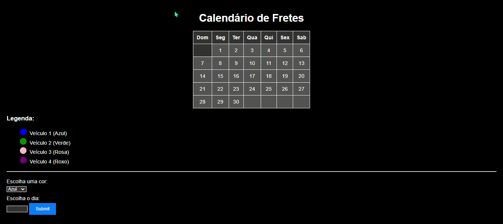

# **Calendário interativo com javascript**

## ``Descrição``
Este projeto consiste em uma aplicação web para visualização e gerenciamento de um calendário de fretes, permitindo o controle de agendamentos de veículos por cores para facilitar a visualização das datas de envio.

## ``Índice``

* [calendar.html](#calendarhtml)
* [calendar.css](#calendarcss)
* [calendar.js](#calendarjs)

## ``Preview``



## ``calendar.html``

```html

<!-- Código HTML -->

<!DOCTYPE html>
<html>
<head>
    <meta charset='utf-8'>
    <meta http-equiv='X-UA-Compatible' content='IE=edge'>
    <title>Calendário</title>
    <meta name='viewport' content='width=device-width, initial-scale=1'>
    <link rel='stylesheet' type='text/css' media='screen' href='calendar.css'>
    <link rel="stylesheet" href="styles.css">
    <script src='cale'></script>
    <script src='calendar.js'></script>
</head>
<body>
    <h1>Calendário de Fretes</h1>
    <table id="calendar">
        <tbody>
            <tr><!-- <Primeira linha  -->
                <th class="domingo">Dom</th>
                <th>Seg</th>
                <th>Ter</th>
                <th>Qua</th>
                <th>Qui</th>
                <th>Sex</th>
                <th>Sab</th>
            </tr>
            <tr>
                <th class="domingo"></th>
                <td>1</td>
                <td>2</td>
                <td>3</td>
                <td>4</td>
                <td>5</td>
                <td>6</td>
            </tr>
            <tr>
                <td class="domingo">7</td>
                <td>8</td>
                <td>9</td>
                <td>10</td>
                <td>11</td>
                <td>12</td>
                <td>13</td>
            </tr>
            <tr>
                <td class="domingo">14</td>
                <td>15</td>
                <td>16</td>
                <td>17</td>
                <td>18</td>
                <td>19</td>
                <td>20</td>
            </tr>
            <tr>
                <td class="domingo">21</td>
                <td>22</td>
                <td>23</td>
                <td>24</td>
                <td>25</td>
                <td>26</td>
                <td>27</td>
            </tr>
            <tr>
                <td class="domingo">28</td>
                <td>29</td>
                <td>30</td>
                <td></td>
                <td></td>
                <td></td>
                <td></td>
            </tr>
        </tbody>
    </table>
    <div id="legend">
        <h3>Legenda:</h3>
        <ul>
            <li><span class="blue"></span> Veículo 1 (Azul)</li>
            <li><span class="green"></span> Veículo 2 (Verde)</li>
            <li><span class="pink"></span> Veículo 3 (Rosa)</li>
            <li><span class="purple"></span> Veículo 4 (Roxo)</li>
        </ul>
    </div>
    <hr/>
    <label for="color">Escolha uma cor:</label>
    <select id="color" name="color">
        <option value="blue">Azul</option>
        <option value="green">Verde</option>
        <option value="pink">Rosa</option>
        <option value="purple">Roxo</option>
    </select>
    <label for="day">Escolha o dia:</label>
    <input type="number" id="day" name="day" min="1" max="31">
    <input type="submit" onclick="colorirDia()">
</body>
</html>
```


## ``calendar.css``

```html

<!-- Código CSS -->

body {
    font-family: Arial, sans-serif;
    margin: 0;
    padding: 20px;
    background-color: black; 
    color: white; 
}

h1 {
    text-align: center;
    margin-bottom: 20px;
    color: white;
}

#calendar {
    max-width: 600px;
    margin: 0 auto;
    border-collapse: collapse;
}

#calendar th,
#calendar td {
    border: 1px solid white; 
    padding: 10px;
    text-align: center;
}

#calendar th {
    background-color: #333; 
}

#calendar td {
    background-color: #555; 
}

#legend {
    margin-top: 20px;
    color: white; 
}

#legend ul {
    list-style-type: none;
}

#legend li {
    margin-bottom: 5px;
}

#legend span {
    display: inline-block;
    width: 20px;
    height: 20px;
    margin-right: 5px;
    border-radius: 50%;
}

.blue {
    background-color: blue;
}

.green {
    background-color: green;
}

.pink {
    background-color: pink;
}

.purple {
    background-color: purple;
}

hr {
    margin-top: 20px;
    margin-bottom: 20px;
    border-color: white; 
}

label {
    display: block;
    margin-bottom: 5px;
}

input[type="number"],
select {
    margin-bottom: 10px;
    background-color: #333; 
    color: white; 
    border: 1px solid white; 
}

input[type="submit"] {
    padding: 10px 20px;
    background-color: #007bff;
    color: #fff;
    border: none;
    cursor: pointer;
}

input[type="submit"]:hover {
    background-color: #0056b3;
}
```
## ``calendar.js``

```html

<!-- Código JS -->

let colorCounts = {};
 
function colorirDia() {
    let days = document.getElementById('day').value;
    let color = document.getElementById('color').value;
    let calendar = document.getElementById('calendar');
    let tds = calendar.getElementsByTagName('td');
   
    if (parseInt(days) > 30) {
        alert("Esse número é inválido. O número não pode ser maior do que 30.");
        return;
    }
 
    let index = parseInt(days) - 1;
   
    if (index >= 0 && index < tds.length) {
        
        if (colorCounts[color] >= 3) {
            alert('O frete não tem capacidade para mais de 3 viagens');
            return; 
        }
       
        colorCounts[color] = (colorCounts[color] || 0) + 1;
 
        tds[index].style.backgroundColor = color;
    } else {
        alert('Dia selecionado está fora do intervalo válido.');
    }
}
```

## ``Funcionalidades``
**Visualicação de calendário:** Exibe um calendário mensal onde os usuários podem visualizar os dias e agendar fretes.

**Coloração de Dias:** Permite ao usuário selecionar uma cor representando um veículo e agendar um frete em um dia específico do mês.

**Legenda de Cores:** Identifica quais cores correspondem a cada veículo.

**Validações:** Garante que os agendamentos sejam feitos dentro do intervalo de dias válidos e controla o número máximo de agendamentos por cor.

## ``Tecnologias utilizadas``
* HTML5
* CSS3
* JavaScript

## ``Autores``

* Deivid Marques
* Ricardo Siena
* Eric Mendes


